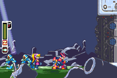
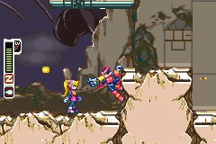

# MegaManZeroRecomp — Mega Man Zero, recompiled

Static recompilation of **Mega Man Zero** (Game Boy Advance) to native PC,
built on the [`gbarecomp`](https://github.com/mstan/gbarecomp) framework.

> **Status — playable static-first bring-up (v0.0.1)**
>
> Mega Man Zero boots through the real GBA BIOS, reaches gameplay, has working
> controls, audio, and persistent SRAM, and is comfortable to play in the
> normal windowed runner. Tested routes through the opening mission have full
> static coverage. The entire game has not been exhaustively proven static:
> an uncovered target falls back to the instruction interpreter, is reported,
> and can be folded into a later static corpus.

## Screenshots

| Opening mission | Active gameplay |
|---|---|
|  |  |

Both images were captured from strict native/LLE verification runs.

## What is recompiled

The original ROM's ARM7TDMI ARM/Thumb code is translated into native C++ ahead
of time. The real GBA BIOS is also recompiled and executed through the LLE path;
BIOS HLE is an optional convenience and is not used to establish correctness.
The `gbarecomp` runtime models the PPU, APU, DMA, timers, interrupts, cartridge
SRAM, input, and other hardware-facing behavior.

This is not a decompilation or a source port. No game source, ROM data, or BIOS
image is included in this repository or its releases.

## ROM identity

| Target | Game | Region/revision | SHA-1 | Debug port |
|---|---|---|---|---|
| `MegaManZeroRecomp` | Mega Man Zero | USA, revision 0 | `193b14120119162518a73c70876f0b8bffdbd96e` | 19862 |

The runtime hash-gates the ROM before execution.

## Quick start

1. Download `MegaManZeroRecomp-windows-x64-v0.0.1.zip` from
   [Releases](../../releases) and extract the whole folder.
2. Run `MegaManZeroRecomp.exe`.
3. Select your own legally obtained Mega Man Zero (USA) ROM and GBA BIOS dump
   when prompted. Their paths are cached for future launches.
4. Play. SRAM saves, save states, and native coverage caches stay beside the
   extracted runner.

## Controls

| GBA input | Keyboard |
|---|---|
| D-Pad | Arrow keys |
| A | Z |
| B | X |
| L | A |
| R | S |
| Start | Enter |
| Select | Right Shift |
| Fast-forward | Hold Tab |

Save states use **Shift+F1–F9** to save and **F1–F9** to load.

## Static coverage and fallback

The normal player build is static-first. A reviewed generated function runs
natively. If indirect control flow reaches an address absent from that corpus,
the runtime executes only that gap in its ARM/Thumb interpreter and emits a
dispatch miss. Self-healing can compile the observed target to native code and
persist it in `recomp_cache/`; the reviewed proposal can then be folded back
into `game.toml` and regenerated for a later release.

Strict verification is deliberately different. With
`GBARECOMP_STRICT_STATIC=1`, caches, self-healing, and interpreter bridging are
disabled, so the first missing PC aborts. A passing strict run is therefore a
path-specific static-coverage proof, not a whole-game claim.

## Verified bring-up evidence

The committed corpus contains 10,885 ARM/Thumb functions, four observed
code-copy mappings, 33 bounded callback/jump-table declarations, and 42 exact
interior resume aliases. These deterministic LLE campaigns pass with zero
dispatch misses, interpreted instructions, healed/cache code, unmapped bus
accesses, or unhandled I/O accesses:

| Profile | Frames | Route covered |
|---|---:|---|
| `campaign` | 30,000 | Reset through the opening mission |
| `campaign-combat` | 60,000 | Sustained movement, attacks, jumps, and dashes |
| `campaign-traverse` | 60,000 | Broad opening-stage traversal and callbacks |
| `campaign-safe` | 30,000 | Lower-risk route to the Golem sequence |
| `campaign-clear` | 30,000 | Golem trigger, Z-Saber grant, and weapon callback |

The cartridge SRAM model starts blank at `0xFF`, supports byte writes and
mirroring, and persists atomically. Strict verification uses a fresh
profile-specific save so previous play cannot hide missing initialization.

### Independent oracle checks

An isolated NanoBoyAdvance run with MP2K HLE disabled, a real BIOS, and blank
SRAM replays the same hardware input. Native frame 14,999 and oracle frame
15,000 are pixel-identical; the one-frame offset is a presentation-boundary
phase difference. The combat route remains exact through native frame 9,558,
after which nearby-frame matching isolates a late animated-sprite/projectile
timing residual. The world/background remains exact in the measured late
combat pair. Those residuals are documented rather than represented as full
all-frame visual parity.

The campaign also exercises a 0x24-byte position-independent routine copied
from ROM `0x080C8900` to overlapping IWRAM/stack placements. The recompiler's
`source_addr` metadata decodes that observed LLE pattern from its ROM source
while retaining runtime relocation; it is not a claim of arbitrary dynamic
code relocation.

## Building from source

Prerequisites on Windows: CMake, Ninja, and MSYS2's mingw64 GCC/G++ and SDL2.
Clone this repository next to `gbarecomp`:

```powershell
git clone https://github.com/mstan/gbarecomp.git
git clone https://github.com/mstan/MegaManZeroRecomp.git
cd MegaManZeroRecomp
```

Place the verified ROM at `roms/megaman_zero_usa.gba`. ROM-derived generated
translation units are intentionally not committed, so build the engine tool
and regenerate them locally:

```powershell
cmake -S ..\gbarecomp -B ..\gbarecomp\build -G Ninja `
  -DCMAKE_C_COMPILER=C:/msys64/mingw64/bin/gcc.exe `
  -DCMAKE_CXX_COMPILER=C:/msys64/mingw64/bin/g++.exe
cmake --build ..\gbarecomp\build --target gba_recompile

pwsh tools/regen.ps1

cmake -S . -B build -G Ninja `
  -DCMAKE_C_COMPILER=C:/msys64/mingw64/bin/gcc.exe `
  -DCMAKE_CXX_COMPILER=C:/msys64/mingw64/bin/g++.exe
cmake --build build --target MegaManZeroRecomp --parallel
```

Run the normal interactive discovery build:

```powershell
pwsh tools/play-discovery.ps1
```

It uses real BIOS/LLE boot, persistent SRAM, static-native dispatch first, and
an interpreter bridge only for uncovered targets. Each session records logs,
coverage JSON, reviewed-proposal fragments, input, ROM/build hashes, and exact
initial/final SRAM snapshots under `build/discovery_sessions/`. Nothing is
automatically merged into `game.toml`.

After reviewing a session, replay it with strict fallback disabled:

```powershell
pwsh tools/verify-strict.ps1 -Frames <final_ppu_frame> `
  -InputProfile user-replay `
  -InputTrace .\build\discovery_sessions\<session>\keyinput.csv `
  -InitialSave .\build\discovery_sessions\<session>\initial.sav
```

Savestate loads are not encoded in input traces, so avoid them in a coverage
session that must be replayed deterministically.

The deterministic verification campaigns are:

```powershell
pwsh tools/verify-strict.ps1
pwsh tools/verify-strict.ps1 -Frames 30000 -InputProfile campaign
pwsh tools/verify-strict.ps1 -Frames 60000 -InputProfile campaign-combat
pwsh tools/verify-strict.ps1 -Frames 60000 -InputProfile campaign-traverse
pwsh tools/verify-strict.ps1 -Frames 30000 -InputProfile campaign-safe
pwsh tools/verify-strict.ps1 -Frames 30000 -InputProfile campaign-clear
python tools/compare_nba_lockstep.py --profile campaign-clear `
  --checkpoints 14000,14500,16000,18000,20000 --image-only
```

Generated guest code is deterministically split into 16 stable shards.
Unchanged regeneration leaves shards untouched, and a local metadata addition
rebuilds only its address-hashed shard.

## Release packaging

With the generated corpus present, produce the same ROM/BIOS-free Windows zip
used by GitHub Releases:

```powershell
powershell -File tools\make_release.ps1 -Version 0.0.1
```

The archive contains the stripped executable, four runtime DLLs, a local
overlay toolchain for native self-healing, and a player README. It does not
contain the ROM, BIOS, save data, symbols, config, or generated source.

## Legal

Mega Man Zero and related names are trademarks of Capcom. This unaffiliated,
non-commercial preservation and research project contains no copyrighted ROM
or BIOS image. You must supply your own legally obtained dumps. The
`gbarecomp` framework is maintained and licensed separately in its own
repository; third-party components retain their respective licenses.

---

<p align="center">
  <sub><b>R.A.I.D. — Retro AI Development</b> · a Discord for AI-assisted retro reverse-engineering, decomp &amp; recomp</sub>
</p>

<p align="center">
  <a href="https://discord.gg/Ad9BwSzctP">Join the Retro AI Development (R.A.I.D.) Discord</a>
</p>
